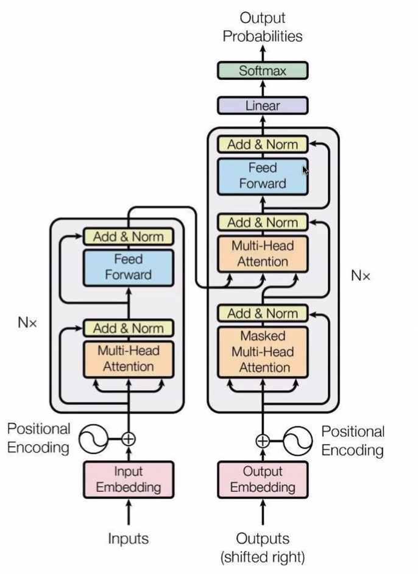
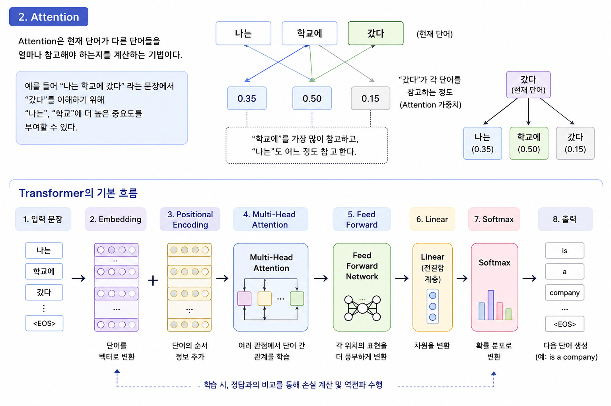

# TIL - 2026-06-09

## 오늘 배운 내용

* 핵심 개념: Transformer, Attention, Multi-Head Attention, Encoder, Decoder, Positional Encoding
* 코드 실습: Transformer 구조 및 구성 요소 이해
* 새로 알게 된 용어: Self-Attention, Masked Attention, Feed Forward Network, Add & Norm

### 1. Transformer

Transformer는 문장 속 단어들의 관계를 Attention으로 계산하여 문맥을 이해하는 모델이다.

기존 RNN은 순차적으로 데이터를 처리했지만, Transformer는 병렬 처리가 가능하여 학습 속도가 빠르고 긴 문장을 더 잘 처리할 수 있다.

### 2. Attention

Attention은 현재 단어가 다른 단어들을 얼마나 참고해야 하는지를 계산하는 기법이다.

예를 들어 "나는 학교에 갔다"라는 문장에서 "갔다"를 이해하기 위해 "나는", "학교"에 더 높은 중요도를 부여할 수 있다.

```python
# Transformer의 기본 흐름

입력 문장
→ Embedding
→ Positional Encoding
→ Multi-Head Attention
→ Feed Forward
→ Linear
→ Softmax
→ 출력
```

## 헷갈린 내용

* Encoder와 Decoder의 역할 차이
* Multi-Head Attention이 왜 여러 개 필요한지
* Add & Norm이 정확히 어떤 역할을 하는지

### 왜 헷갈렸는지

Transformer 그림을 보면 블록이 많아서 데이터가 어떤 순서로 흐르는지 한 번에 이해하기 어려웠다.

### 내가 이해한 방식

* Encoder = 입력 문장 이해
* Decoder = 다음 단어 생성
* Attention = 단어끼리 관계 계산
* Multi-Head = 여러 관점에서 관계 분석
* Positional Encoding = 단어 순서 정보 추가

## 정리

Transformer는 Attention을 이용하여 문장 내 단어 관계를 병렬로 계산하는 모델이다.

기존 RNN의 긴 문장 처리 문제를 개선했으며 현재 GPT, BERT 같은 대형 언어 모델의 기반이 된다.

### 실무/프로젝트에서 어떻게 쓸 수 있을지

* 챗봇 개발
* 번역 모델
* 문서 요약
* 질의응답 시스템
* GPT 기반 서비스 구현

### 내일 복습할 것

* Query, Key, Value(QKV)
* Self-Attention 계산 과정
* Multi-Head Attention 구조
* Encoder와 Decoder 데이터 흐름
