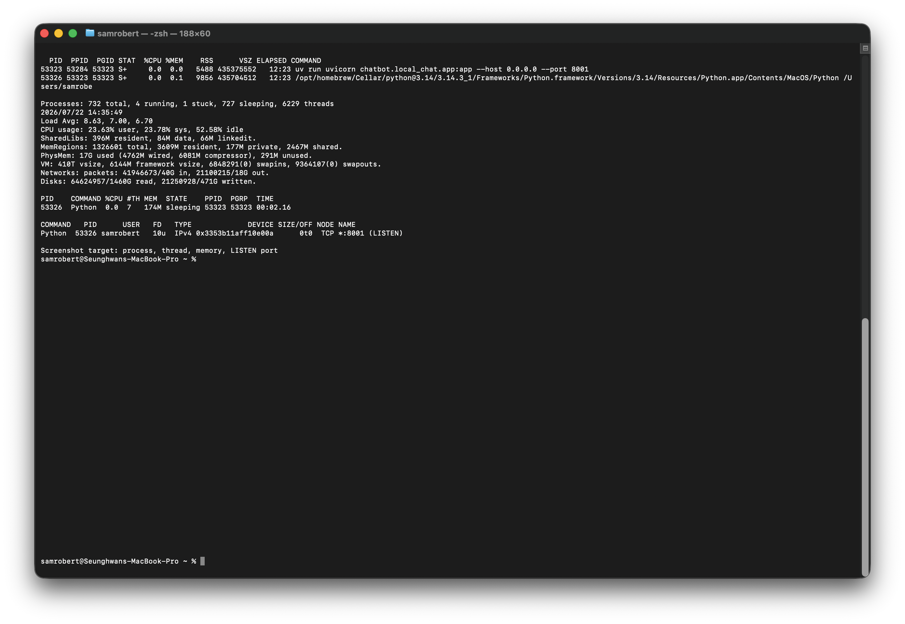

# 1. 서버 프로세스·스레드·메모리 관찰

> 개인 프로젝트 FastAPI 서버를 macOS에서 실행한 뒤 `ps`, `top`, `lsof`, `vmmap`으로 프로세스·스레드·메모리 상태를 확인했다.

## 1-1. 관찰 환경

| 항목 | 내용 |
|---|---|
| OS | macOS (Darwin) |
| 개인 프로젝트 | Leon's Local ChatBot (`RAG_chatbot`) |
| 실행 도구 | `uv` |
| 런타임 | Python 3.14 |
| 서버 | FastAPI + Uvicorn |
| 실행 주소 | `0.0.0.0:8001` |
| 관찰 도구 | `ps`, `top`, `lsof`, `vmmap` |

서버는 아래처럼 실행했다.

```bash
cd /Users/samrobert/Documents/GitHub/KakaoBootCamp/RAG_chatbot
uv run uvicorn chatbot.local_chat.app:app --host 0.0.0.0 --port 8001
```

## 1-2. `ps`로 프로세스 확인

```bash
ps -ef | grep -E 'uvicorn|chatbot.local_chat|RAG_chatbot' | grep -v grep
```

```text
501 53323 53284 0 2:23PM ttys002 0:00.05 uv run uvicorn chatbot.local_chat.app:app --host 0.0.0.0 --port 8001
501 53326 53323 0 2:23PM ttys002 0:05.87 .../Python .../RAG_chatbot/.venv/bin/uvicorn chatbot.local_chat.app:app --host 0.0.0.0 --port 8001
```

`uv run`과 Python이 같이 나와서 처음에는 둘 다 서버인 줄 알았다. PPID를 보니 Python 쪽이 `uv run`의 자식으로 떠 있었다. 실제 HTTP 요청은 아래 Python 프로세스가 받기 때문에 이후에는 PID `53326`을 기준으로 확인했다.

| PID | PPID | 확인한 역할 |
|---:|---:|---|
| 53323 | 53284 | 가상환경의 Uvicorn 실행을 연결하는 `uv run` 프로세스 |
| 53326 | 53323 | 실제 FastAPI/Uvicorn 서버 Python 프로세스 |



## 1-3. `top`으로 스레드와 메모리 확인

```bash
top -l 1 -pid 53326 -stats pid,command,cpu,threads,mem,state,ppid,pgrp,time
```

```text
PID    COMMAND %CPU #TH MEM  STATE    PPID  PGRP  TIME
53326  Python  0.0  7   174M sleeping 53323 53323 00:05.86
```

`#TH`는 스레드 수이고, 이번 서버는 7개로 나왔다. 메모리는 약 174MB였다. 아무 요청도 보내지 않은 상태에서 확인했기 때문에 CPU는 `0.0%`, 상태는 `sleeping`이었다.

루트 페이지를 한 번 열고 다시 확인해도 값이 거의 같았다. 화면을 내려주는 요청은 아주 빨리 끝나서 `top` 한 번의 화면에는 변화가 잘 잡히지 않았다. 챗봇 질문은 외부 LLM 응답을 기다리는 시간이 있어서, 화면 요청보다는 오래 걸릴 것으로 보인다.

## 1-4. `lsof`로 열려 있는 포트 확인

```bash
lsof -nP -iTCP:8001 -sTCP:LISTEN
```

```text
COMMAND   PID      USER   FD   TYPE   NAME
Python  53326 samrobert   10u  IPv4   TCP *:8001 (LISTEN)
```

여기에서도 Python PID가 `53326`으로 나왔다. `*:8001 (LISTEN)`이라고 표시돼서 이 프로세스가 8001번 포트를 열고 요청을 기다리고 있는 것을 확인했다. `--host 0.0.0.0`으로 실행했기 때문에 같은 Wi-Fi의 다른 기기도 서버 주소로 접속할 수 있다.

## 1-5. `vmmap`으로 실제 메모리 확인

```bash
vmmap 53326 | head -40
```

```text
Process: Python [53326]
Parent Process: uv [53323]
Physical footprint: 174.0M
Physical footprint (peak): 174.7M
```

`Physical footprint`는 실제 물리 메모리 사용량이다. 약 174MB가 나왔다. FastAPI만 실행하는 것이 아니라 챗봇에서 사용하는 `torch`, `numpy`, `sqlite` 같은 라이브러리도 같이 불러오기 때문에 기본 메모리가 이 정도 사용된 것으로 봤다.

## 1-6. 정리

서버 실행 뒤에는 `uv run` 부모 프로세스와 실제 Uvicorn Python 프로세스가 따로 떠 있었다. 실제 서버인 Python 프로세스는 8001번 포트를 열고 있었고, 요청이 없을 때는 `sleeping` 상태로 대기했다. 이번 관찰에서는 스레드 7개, 메모리 약 174MB를 사용했다.

