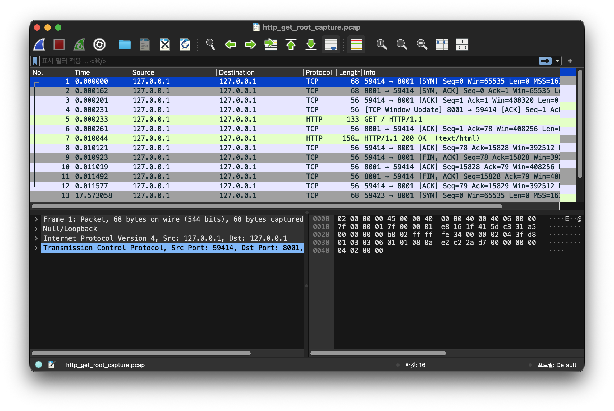

# 2. Wireshark로 HTTP/HTTPS 통신 캡처

> 개인 프로젝트 FastAPI 서버로 보낸 HTTP 요청을 Wireshark에서 확인했다.

## 2-1. 관찰 환경

| 항목 | 내용 |
|---|---|
| 서버 | Leon's Local ChatBot FastAPI/Uvicorn |
| 서버 포트 | `8001` |
| 현재 캡처 인터페이스 | `lo0` (Loopback) |
| 캡처 도구 | Wireshark, `tcpdump` |
| Wireshark 필터 | `tcp.port == 8001`, `http` |
| 요청 | `GET /` |

서버는 `0.0.0.0:8001`에서 실행했다. 실제 사설 IP는 공개 저장소에 올리지 않고 `<SERVER_PRIVATE_IP>`로 표시했다.

## 2-2. 캡처 방법

로그인이나 채팅 요청은 비밀번호·토큰·질문 내용이 화면에 남을 수 있어서, 캡처에는 루트 페이지 요청만 사용했다.

```bash
tcpdump -i lo0 -nn -A -s 0 -c 12 'tcp port 8001'
curl http://127.0.0.1:8001/
```

Wireshark에서는 먼저 `tcp.port == 8001` 필터를 걸고, HTTP 패킷만 다시 보기 위해 `http` 필터를 사용했다.

## 2-3. 실제로 본 패킷

아래 사진은 `lo0`에서 루트 페이지 요청을 보낸 뒤 Wireshark로 연 화면이다. 처음에는 `SYN`, `ACK` 줄만 계속 보여서 어디가 요청인지 찾기 어려웠다. `tcp.port == 8001`을 먼저 걸고, 다시 `http` 필터를 걸어 보니 `GET /`와 `HTTP/1.1 200 OK`가 보였다.



화면을 위에서 아래로 보면 처음 세 줄이 `SYN → SYN, ACK → ACK`이다. 이건 클라이언트와 서버가 연결을 만드는 과정이다. 그 아래 `GET / HTTP/1.1`이 요청이고, 서버에서 `HTTP/1.1 200 OK`로 답했다. 맨 아래의 `FIN, ACK`는 요청이 끝난 뒤 연결을 닫는 부분이다.

패킷 내용 일부도 다음처럼 확인됐다.

```text
127.0.0.1.59414 > 127.0.0.1.8001: Flags [S]
127.0.0.1.8001 > 127.0.0.1.59414: Flags [S.]

GET / HTTP/1.1
Host: 127.0.0.1:8001
User-Agent: curl/8.7.1

HTTP/1.1 200 OK
server: uvicorn
content-type: text/html; charset=utf-8

127.0.0.1.59414 > 127.0.0.1.8001: Flags [F.]
127.0.0.1.8001 > 127.0.0.1.59414: Flags [F.]
```

이번에는 루트 페이지만 열었기 때문에 비밀번호나 토큰은 없었다. 그래도 `GET /`, `Host`, `User-Agent` 같은 값은 그대로 보였다. HTTP로 로그인이나 채팅 요청을 보내면 본문도 이렇게 보일 수 있으니, 외부에 올릴 때는 HTTPS를 써야 한다.

## 2-4. HTTPS일 때 차이

HTTP에서는 Wireshark로 요청 주소, 헤더, 본문까지 확인할 수 있다. 반대로 HTTPS는 TLS로 감싸져 있어서 서버 IP, 포트, TLS 연결 여부 정도만 볼 수 있고, 복호화 키가 없으면 비밀번호나 질문 내용은 읽을 수 없다.

## 2-5. 과제 조건 관련

현재 첨부한 캡처는 같은 Mac에서 테스트한 `lo0` 캡처다. 따라서 “클라이언트가 서버와 다른 컴퓨터” 조건까지 충족하려면 아래처럼 한 번 더 캡처해야 한다.

1. 서버 Mac에서 Wireshark의 Wi-Fi 인터페이스 `en0`를 선택한다.
2. 다른 노트북 또는 휴대폰에서 `http://<SERVER_PRIVATE_IP>:8001`에 접속한다.
3. 서버 Mac에서 `tcp.port == 8001` 필터를 적용한다.
4. 그 화면을 추가로 저장한다.

